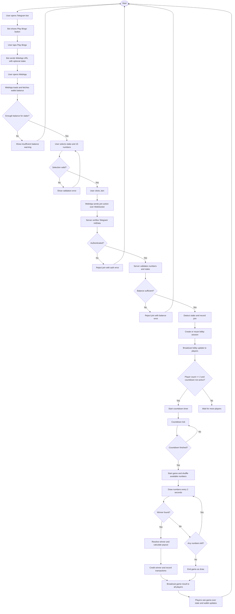
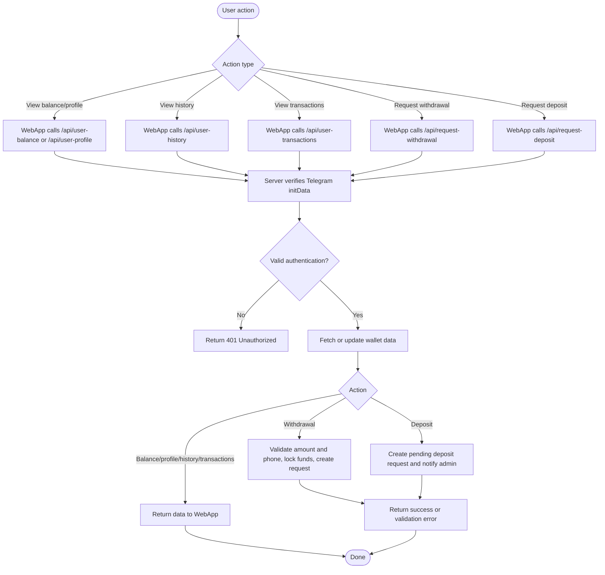

# Bingo System Activity Diagram

This document captures the main activity flow for the Telegram Bingo mini-app, including bot launch, WebApp gameplay, lobby progression, draw resolution, and wallet-related actions.

## 1) End-to-end gameplay activity

## 2) Wallet and profile activity

## 3) Key components involved

- Telegram Bot: launches the WebApp and starts the game flow
- WebApp frontend: handles selection, join, and live game UI
- WebSocket server: manages lobby join, countdown, and live number draw events
- API server: exposes authenticated wallet and profile endpoints
- PostgreSQL: stores balances, game history, transactions, deposits, and withdrawals
